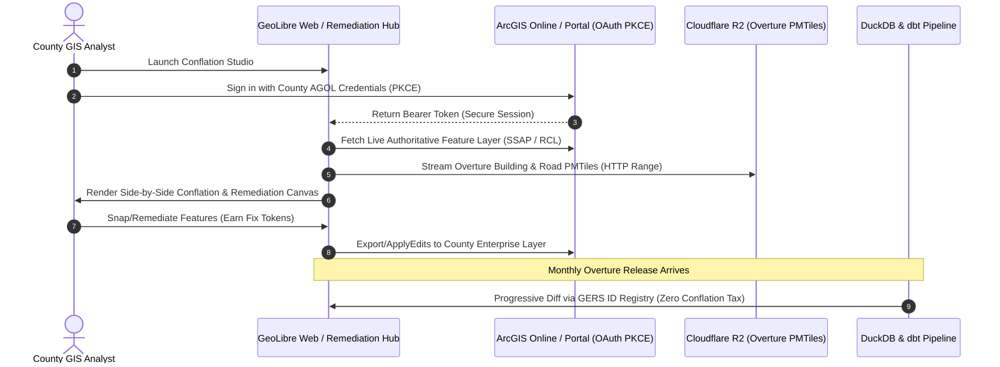

# GeoLibre ArcGIS Online / Portal Conflation Workflow & Progressive Overture Sync

**Author:** County of Fresno & Cal OES NG911 GIS Committee  
**Target Systems:** GeoLibre Web, Esri ArcGIS Online (AGOL) / Enterprise Portal, Overture Maps Foundation  
**Version:** 1.0.0 (2026 Edition)

---

## 1. Overview & Architecture

GeoLibre recently introduced native support for **ArcGIS Online (AGOL) and ArcGIS Enterprise Portal authentication (OAuth 2.0 PKCE)**. This allows authoritative dataset owners (e.g. County GIS Coordinators, City CAD Engineers, and PSAP Administrators) to securely authenticate with their enterprise GIS organization and load live, authoritative Feature Services right alongside our cloud-native Cloudflare R2 PMTiles conflation layers.



---

## 2. Step-by-Step Workflow for Dataset Owners

### Step 1: OAuth PKCE Authentication in GeoLibre
1. Open the [GeoLibre NG911 Conflation Project](https://web.geolibre.app/?url=https://pub-152dce9299c94555bb415d992fe120e7.r2.dev/ng911_address_comparison.geolibre.json).
2. Click **Add Layer** ➔ **ArcGIS Feature Service**.
3. Select **Sign in with ArcGIS Online** (or enter your organization's Portal URL: `https://gis.fresnocountyca.gov/portal`).
4. Complete the standard organizational sign-in. GeoLibre receives an OAuth PKCE token with scoped read/edit privileges.

### Step 2: Layer Side-by-Side Overlay
1. Select your county's authoritative layer:
   - `County_Addresses_Authoritative` (Feature Layer)
   - `County_RoadCenterlines` (Feature Layer)
2. GeoLibre loads these features over the **Caltrans 30cm Ortho Basemap** alongside:
   - `fresno_buildings.pmtiles` (Overture 3D Building Footprints)
   - `fresno_ssap.pmtiles` (Conflated & Validated NG911 Addresses)
   - `fresno_fishbones.pmtiles` (Road Offset Snapping Vectors)
3. Activate the **Swipe Plugin** (`plugins: ["swipe"]`) to instantly compare authoritative placement against physical rooftops on high-res aerial imagery.

---

## 3. Eliminating the "Conflation Tax" via GERS ID

A traditional pain point in open-source GIS basemaps is the recurring **"Conflation Tax"**: every time a vendor or open map project issues a new monthly data release, GIS departments must rerun costly, computationally heavy spatial joins from scratch.

### The Overture GERS Solution:
* **Permanent, Decentralized Anchor:**  
  Overture assigns every entity an immutable, global 64-bit hexadecimal identifier (**GERS ID**).
* **Lineage Join Table:**  
  Our pipeline maintains a permanent crosswalk table (`mart_ng911_gers_lineage`):
  ```sql
  CountyLocalID (APN) ─── GERS_AddressID ─── GERS_BuildingID ─── NENA_NGUID
  ```
* **Monthly Release Delta Sync (Progressive Updating):**  
  When Overture drops a new theme release (e.g. `2024-10-22` ➔ `2024-11-20`), our pipeline uses DuckDB and `daff` to perform a fast key-based join on GERS IDs. Only entities with modified geometry or new attributes are flagged.
* **No Re-matching Required:**  
  All previously remediated, verified, and tokenized address points preserve their validated status permanently.

---

## 4. Submitting Remediations Back to County Enterprise SDE

When an analyst corrects a point in the Remediation Hub:
1. The tool automatically packages an **Esri REST `applyEdits`** payload:
   ```json
   {
     "id": 0,
     "updates": [
       {
         "geometry": { "x": -119.8819, "y": 36.6834, "spatialReference": { "wkid": 4326 } },
         "attributes": {
           "CountyLocalID": "FRESNO_ADDR_104829",
           "SSAP_NGUID": "urn:emergency:uid:gis:SSAP:08f28308470a1a0b@fresnocountyca.gov",
           "RemediationAction": "SNAPPED_INTO_BUILDING_FOOTPRINT",
           "RemediationStatus": "REMEDIATED_VALID"
         }
       }
     ]
   }
   ```
2. The county GIS administrator can either:
   - Click **Apply Edits to AGOL** directly via the authenticated OAuth token.
   - Download the `.json` / `.geojson` file and batch-merge it via ArcGIS Pro or Python ArcGIS API (`arcgis.features.FeatureLayer.edit_features`).
